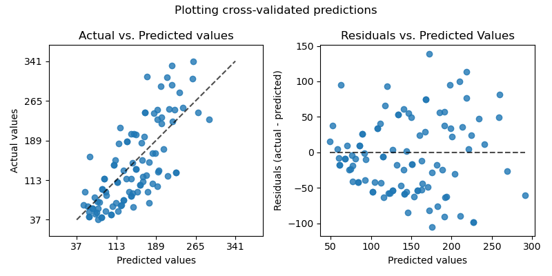
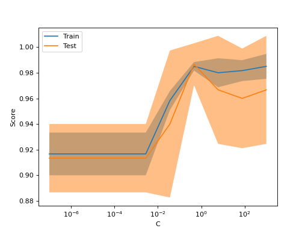
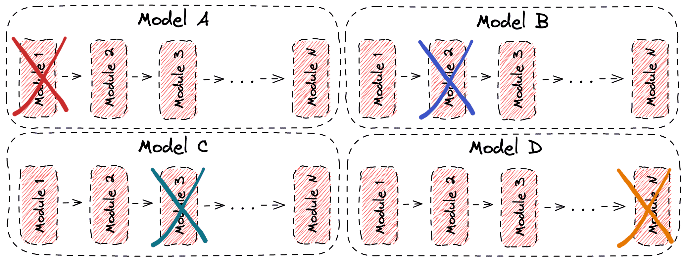

# Metricas de evaluacion para regresion

- **$R^2$:** Representa la proporción de la varianza que puede ser explicada por las variables independientes en el modelo.
$R^2(y,y')= 1 - \sum\frac{(y_i-y'_i)^2}{(y_i- \bar{y})^2 }$

- **Error absoluto medio:** $MAE(y,y')= \frac{1}{n} \sum |y_i-y'_i|$

- **Error cuadratico medio:** $MSE(y,y')= \frac{1}{n} \sum (y_i-y'_i)^2$

- **Raiz del error cuadratico medio:** $RMSE = \sqrt(MSE)$

- **Error logaritmico cuadratico medio**: Se usa en datos que tienen crecimiento exponencial (no es nuestro caso)

- **Error porcentual absoluto medio**:  Sensible al error relativo. $MAPE(y,y')= \frac{1}{n} \sum  \frac{|y_i-y'_i|}{max(\epsilon, y_i)}$ ($\epsilon$ es un numero positivo arbitrariamente pequeno, para evitar divisiones por 0).

- **Error absoluto mediano:** Robusto contra outliers $MedAE(y,y') = Median(|y_1-y'_1|, ... , |y_n-y'_n|)$

- **Maximo error:** cuando la interpretación del peor caso es más significativa que el error promedio. $MaxAE(y,y') = max(|y_i-y'_i|)$

### Evaluacion visual

# Validacion

## Selección de hiperparámetros

El **ajuste de hiperparámetros** es un proceso crítico en el desarrollo de modelos de machine learning. Consiste en encontrar la configuración óptima de hiperparámetros para el comportamiento de un algoritmo de aprendizaje automático. Estos parámetros tienen un impacto significativo en el rendimiento del modelo, y elegir los hiperparámetros correctos puede ser la diferencia entre un modelo poco efectivo y uno que alcance resultados de vanguardia.

En **scikit-learn** se proporcionan dos enfoques genéricos para la búsqueda de parámetros:

1. **`GridSearchCV`**: considera exhaustivamente todas las combinaciones de parámetros en un espacio definido.
2. **`RandomizedSearchCV`**: muestrea un número dado de candidatos del espacio de parámetros con una distribución especificada.

Ambas herramientas tienen contrapartes de **halving**: `HalvingGridSearchCV` y `HalvingRandomSearchCV`, que pueden ser mucho más rápidas para encontrar una buena combinación de parámetros.

Para más detalles sobre estas estrategias y tips, consulta la [documentación oficial](https://scikit-learn.org/1.5/modules/grid_search.html).

Existen varias estrategias y herramientas más allá de `GridSearchCV` y `RandomizedSearchCV` para optimizar hiperparámetros. Algunos ejemplos son:

**Búsqueda Bayesiana**  
   Este método utiliza modelos probabilísticos para construir una función de probabilidad del espacio de hiperparámetros y selecciona las configuraciones que probablemente optimicen el modelo.

**Optimización Evolutiva (Algoritmos Genéticos)**  
   Se basa en la evolución natural para iterar sobre configuraciones de hiperparámetros, utilizando operaciones como selección, cruce y mutación.

**AutoML**  

## Hiperparametros de una GNN

#### 1. Arquitectura de la Red GNN:

•   Número de Capas (Número de GNN layers):
- Descripción: Determina la profundidad de la red GNN. Cada capa agrega información de los vecinos en el grafo.
- Ajuste: Redes más profundas pueden capturar relaciones más complejas, pero también pueden sufrir de sobreajuste o desvanecimiento del gradiente. Empieza con pocas capas (2-3) y luego aumenta la profundidad según sea necesario.
- Consideraciones: Depende de la complejidad de las relaciones en el grafo. Grafos más pequeños o menos complejos pueden funcionar mejor con menos capas.

•   Tipo de Capa GNN:
- Descripción: Elige el tipo específico de capa GNN que quieres usar (ej: Graph Convolutional Network (GCN), Graph Attention Network (GAT), GraphSAGE, etc). Cada capa tiene sus propias ecuaciones de agregación de información.

•   Dimensiones de los Embeddings:
- Descripción: Define la dimensión de los vectores de características de los nodos y los mensajes intercambiados entre nodos (hidden dimensions).
- Ajuste: Valores más grandes pueden capturar más información, pero también pueden aumentar la complejidad del modelo. Empieza con valores razonables (32, 64, 128) y ajusta según la necesidad.
  
•   Funciones de Activación:
- Descripción: Elige las funciones de activación a usar en las capas GNN (ej: ReLU, LeakyReLU, tanh, etc).
- Consideraciones: ReLU es una opción común y funciona bien en la mayoría de los casos.
        

#### 2. Hiperparámetros de Agregación de Información:

•   Número de Vecinos Muestreados: (Para GraphSAGE u otros métodos basados en muestreo)
- Descripción: Determina cuántos vecinos se muestrean para agregar la información de cada nodo.
- Ajuste:  Un número alto de vecinos puede capturar más información, pero también aumentar el costo computacional. Valores bajos pueden ser más eficientes, pero pueden perder información.  Valores comunes son 10, 25, 50.
- Consideraciones: Depende del tamaño y la densidad del grafo.

•   Atención en GAT: (Para Graph Attention Networks)
- Descripción: Determina el tipo y la estructura de la atención (número de heads, dimensión de atención, etc).
- Ajuste: Ajusta estos hiperparámetros para optimizar el peso que se da a los vecinos más relevantes.
- Consideraciones: Más heads pueden aprender diferentes tipos de relaciones entre nodos.
   Puede ser computacionalmente más costoso.

•   Función de Agregación:
- Descripción: Determina como se agregan las representaciones de los vecinos a la representación del nodo central (ej: suma, media, max, concatenación).
- Ajuste: Prueba diferentes funciones de agregación y evalúa cual mejora el rendimiento.
- Consideraciones: Suma o promedio son opciones comunes y eficientes. Otras funciones pueden funcionar mejor para la tarea específica.

#### 3. Hiperparámetros de Entrenamiento:

•   Learning Rate:
- Descripción: Controla el tamaño del paso durante la optimización.
- Ajuste: Valores pequeños pueden llevar a un aprendizaje lento, mientras que valores grandes pueden llevar a una convergencia inestable. Empieza con valores como 0.01 o 0.001 y ajusta según sea necesario.
- Consideraciones: Puede requerir ajustes dinámicos a través de un scheduler.

•   Batch Size:
- Descripción: Determina el número de muestras que se usan en cada paso de la optimización.
- Ajuste:  Valores grandes pueden acelerar el entrenamiento pero pueden tener problemas de memoria. Valores pequeños pueden llevar a un entrenamiento más estable pero más lento.  Valores comunes son 32, 64, 128.
- Consideraciones: Depende de la cantidad de memoria de tu GPU.

•   Número de Épocas (epochs):
- Descripción: Define cuántas veces se itera sobre el conjunto de entrenamiento.
- Ajuste: Ajusta hasta que el modelo converja y el rendimiento de la validación no mejore significativamente.
- Consideraciones: El *early stopping* puede ser una técnica útil para detener el entrenamiento.

•   Regularización (dropout, weight decay):
- Descripción: Técnicas para prevenir el sobreajuste.
- Dropout: Desactiva neuronas aleatoriamente durante el entrenamiento.
- Weight Decay: Agrega una penalización a los pesos grandes.
- Consideraciones: El dropout es común en las redes neuronales pero puede no ser necesario con grafos pequeños.

#### 4. Hiperparámetros Específicos de la Tarea:

•   Función de Pérdida: (Para problemas de regresión)
-  Descripción: Define la función que se minimiza durante el entrenamiento (ej: MSE, MAE).
-  Consideraciones: MSE es común, pero MAE puede ser más robusto a outliers.

•   Dropout/Regularizacion en Capas Lineales: (después de la capa GNN)
-  Descripción: Dropout y regularización (l2) en la capa de salida de la GNN que genera las predicciones.
   
#### Estrategias de Ajuste

-   Búsqueda Manual: Ajusta los hiperparámetros de forma manual, probando diferentes valores uno a la vez, es un buen punto de inicio.
-   Búsqueda en Grilla (Grid Search): Prueba todas las combinaciones posibles de hiperparámetros en un rango especificado.
-   Búsqueda Aleatoria (Random Search): Prueba combinaciones aleatorias de hiperparámetros en rangos especificados, más eficiente que la busqueda en grilla.
-   Optimización Bayesiana: Usa métodos de optimización bayesiana para encontrar los hiperparámetros óptimos de forma más eficiente.
-   Frameworks Automatizados: Utiliza frameworks como Optuna, Hyperopt o Ray Tune para automatizar la búsqueda de hiperparámetros.

#### Recomendaciones:

-  Comienza con la arquitectura más sencilla (pocas capas y dimensiones).
-  Ajusta primero la arquitectura general y luego los hiperparámetros de entrenamiento.
-   Utiliza validación cruzada para evaluar el rendimiento de diferentes hiperparámetros.
-   Visualiza los resultados para entender como afectan cada hiperparámetro al entrenamiento.

## Curva de Validación

Para validar un modelo, se necesita una función de puntuación, como *accuracy* para clasificadores.  

La forma adecuada para seleccionar múltiples hiperparámetros de un estimador es a través de **grid search** u otros métodos similares. Estos métodos eligen los hiperparámetros que maximizan el puntaje en un conjunto de validación o múltiples conjuntos de validación.  

Sin embargo, a veces, resulta útil graficar cómo un único hiperparámetro influye en los puntajes de entrenamiento y validación para identificar si el modelo está sobreajustando o subajustando a ciertos valores del hiperparámetro.

*¿Qué es una curva de validación?*

Una **curva de validación** muestra cómo el cambio en un hiperparámetro afecta el rendimiento del modelo.  

Nos permite analizar la relación entre la complejidad del modelo (como el número de características o la profundidad de un árbol de decisión) y el rendimiento en los datos de entrenamiento y validación.

*Interpretación de la curva de validación*:
- **Detección de sobreajuste**:  
  Si el rendimiento en entrenamiento es significativamente mejor que en validación, el modelo está sobreajustando. Esto indica que el modelo está memorizando los datos de entrenamiento, pero no generaliza bien a datos nuevos.

- **Detección de subajuste**:  
  Si el rendimiento en entrenamiento y validación son bajos, el modelo está subajustando. Esto sugiere que el modelo es demasiado simple para capturar los patrones en los datos.

  ### Curva de Aprendizaje

Una **curva de aprendizaje** muestra cómo varían la puntuación de entrenamiento y validación de un estimador a medida que cambia el número de muestras de entrenamiento utilizadas. Es una herramienta muy útil para determinar:

- **Qué tanto se beneficia el modelo al agregar más datos de entrenamiento.**  
- **Si el modelo tiene más problemas con errores por varianza o por sesgo (bias).**

*Generación de la Curva de Aprendizaje*

Para obtener los valores necesarios para graficar la curva de aprendizaje (número de muestras utilizadas, la media de las puntuaciones en los conjuntos de entrenamiento y validación), se puede utilizar la función `learning_curve`.

Si solo necesitas graficar la curva de aprendizaje, es más sencillo utilizar la clase `LearningCurveDisplay`.

La siguiente imagen ilustra lo que se considera una *curva de aprendizaje ideal* en el contexto de entrenamiento de modelos de Machine Learning:

### Interpretabilidad de los modelos de aprendizaje

En **Machine Learning (ML)**, la **interpretabilidad** y la **explicabilidad** son conceptos fundamentales para comprender cómo un modelo toma sus decisiones. Esto es crucial porque permite:

- Generar confianza en los resultados.
- Detectar y corregir sesgos.
- Diagnosticar debilidades para mejorar el rendimiento.
- Cumplir con regulaciones legales y éticas.

En aplicaciones críticas como **medicina, finanzas o justicia**, entender por qué un modelo toma una decisión es esencial para evitar errores y asegurar la transparencia. Además, estas prácticas permiten:

- Optimizar los modelos.
- Identificar sus limitaciones.
- Garantizar que sus decisiones sean responsables y seguras para los usuarios.

### **Analisis de sensibilidad**

#### Resumen
La sensibilidad de características  evalúa el impacto de cada característica en la predicción del modelo al modificarla. Si cambias el valor de una característica y el modelo produce una predicción diferente, eso indica que esa característica tiene un gran impacto en el resultado. Es como hacer una prueba de resistencia para ver qué características son más sensibles a cambios. Esta técnica funciona bien con modelos de caja negra porque no requiere entender cómo funciona el modelo internamente; solo necesitas analizar cómo cambia la predicción cuando modificas las características.

Para una muestra específica del conjunto de datos, modifica una característica y mide cómo cambia la predicción del modelo.
Si al modificar una característica, el modelo cambia significativamente su predicción, entonces esa característica tiene una alta sensibilidad y, por lo tanto, una gran influencia sobre el resultado.
Puedes usar esta técnica para identificar qué características son más importantes para el modelo en su conjunto y cuáles pueden no ser tan relevantes.

---

#### Principios del Análisis de Sensibilidad

El análisis se basa en alterar los valores de una característica específica mientras se mantienen las demás constantes. Posteriormente, se evalúa cómo varían las predicciones del modelo debido a estos cambios. Si el cambio en los valores de una característica produce una alteración significativa en las predicciones, se concluye que esa característica tiene un impacto considerable en el modelo.

El cálculo puede formalizarse como sigue:

1. Se obtiene el desempeño inicial del modelo en un conjunto de prueba (p. ej., error cuadrático medio, precisión, etc.).
2. Se transforma una característica específica aplicando alguna de las técnicas descritas más adelante.
3. Se evalúa el modelo con las características transformadas.
4. La sensibilidad se define como la diferencia en el desempeño del modelo antes y después de la transformación.

#### Métodos de Transformación

El impacto de cada característica puede medirse aplicando diferentes tipos de transformaciones. Los métodos más comunes son:

1. **Distribución uniforme**: Se reemplaza el valor de una característica por otro seleccionado de manera aleatoria dentro de su rango de valores posibles. Este método da igual peso a todos los valores posibles de la característica, pero puede sobreestimar la sensibilidad en caso de que los valores más comunes tengan un efecto menor en el modelo.

2. **Permutación**: Los valores de la característica se reorganizan aleatoriamente según su distribución en los datos. Este enfoque considera la distribución real de los valores en los datos, lo que lo hace robusto para características sesgadas.

3. **Simulación de valores faltantes**: Se intenta simular la ausencia de una característica. Por ejemplo:
   - Sustituir los valores numéricos por su media.
   - Reemplazar valores categóricos por una nueva clase.
   - Usar el valor más frecuente en lugar del original.

#### Consideraciones en Producción

El análisis de sensibilidad puede ser computacionalmente costoso, ya que requiere múltiples predicciones, especialmente en conjuntos de datos grandes o con muchas características. Para optimizar su uso en producción, se pueden implementar las siguientes estrategias:

- **Submuestreo**: Utilizar un subconjunto representativo de los datos para reducir la cantidad de predicciones necesarias.
- **Paralelización**: Ejecutar las predicciones de manera simultánea, aprovechando múltiples procesadores o núcleos.
- **Análisis por etapas**: Inicialmente calcular sensibilidades aproximadas con pocos datos, y luego refinar los resultados para las características más relevantes.

#### Aplicaciones Prácticas

El análisis de sensibilidad permite:
- Identificar características clave que explican el comportamiento del modelo.
- Detectar características con baja relevancia para eliminarlas y simplificar el modelo.
- Identificar fugas de datos (leakage) cuando una característica tiene un impacto inesperadamente alto.

### Estudio de Ablación en Machine Learning

En muchos casos en Machine Learning, los modelos están formados por múltiples componentes que influyen en el rendimiento total del sistema. Por ello, es muy importante contar con métodos para medir la contribución de cada una de estas partes al modelo en su conjunto. Aquí es donde entra el concepto de **estudio de ablación**.

---

#### ¿Qué es un Estudio de Ablación?

Un **estudio de ablación** consiste en eliminar partes específicas de un modelo para analizar su impacto en el comportamiento general del sistema. Esta técnica permite comprender qué componentes o módulos del modelo son críticos para su rendimiento y cuáles no tienen un impacto significativo.

En un estudio de ablación, se investigan las siguientes preguntas:

- **¿Qué tan importante es cada parte del modelo para el rendimiento general?**  
- **¿Qué componentes son redundantes y pueden ser eliminados sin afectar el comportamiento esperado del modelo?**  
- **¿Cómo influyen ciertos módulos individuales en la capacidad de aprendizaje o predicción del modelo?**

---

#### ¿Por qué es Importante?

En un sistema de Machine Learning, generalmente existen múltiples módulos de aprendizaje, como capas en una red neuronal, algoritmos de preprocesamiento, técnicas de regularización, entre otros. Comprender el efecto de cada uno de estos módulos es esencial para:

1. **Identificar la importancia relativa de cada componente.**  
2. **Optimizar el modelo eliminando elementos redundantes.**  
3. **Diagnosticar problemas en el comportamiento del modelo.**  

El estudio de ablación es una manera de realizar análisis causal de forma eficiente, con un coste computacional relativamente bajo.

---

#### Ejemplo: Ablación en Redes Neuronales

Por ejemplo, se puede realizar un estudio de ablación en una red neuronal eliminando una o varias capas para estudiar su influencia:

1. Se entrena la red con todas las capas y se mide el rendimiento de referencia.  
2. Se eliminan una o varias capas de la arquitectura de la red.  
3. Se vuelve a entrenar la red y se comparan los resultados con el rendimiento de referencia.

Al comparar ambos resultados, es posible determinar si la capa eliminada tiene un impacto significativo en la precisión o en el aprendizaje general.

---

#### Beneficios del Estudio de Ablación

- **Reducción de complejidad computacional.**  
- **Comprensión de los efectos causales de los componentes.**  
- **Facilita la mejora y optimización del diseño del modelo.**  
- **Identificación de componentes críticos y posibles redundancias.**

---

En conclusión, el **estudio de ablación** es una herramienta poderosa para realizar diagnósticos, optimizar y comprender mejor cómo funciona un modelo de Machine Learning. Se basa en una eliminación sistemática de componentes para analizar su influencia, lo que permite descubrir relaciones causales dentro del diseño de los modelos.
La siguiente imagen ilustra este procedimiento:

